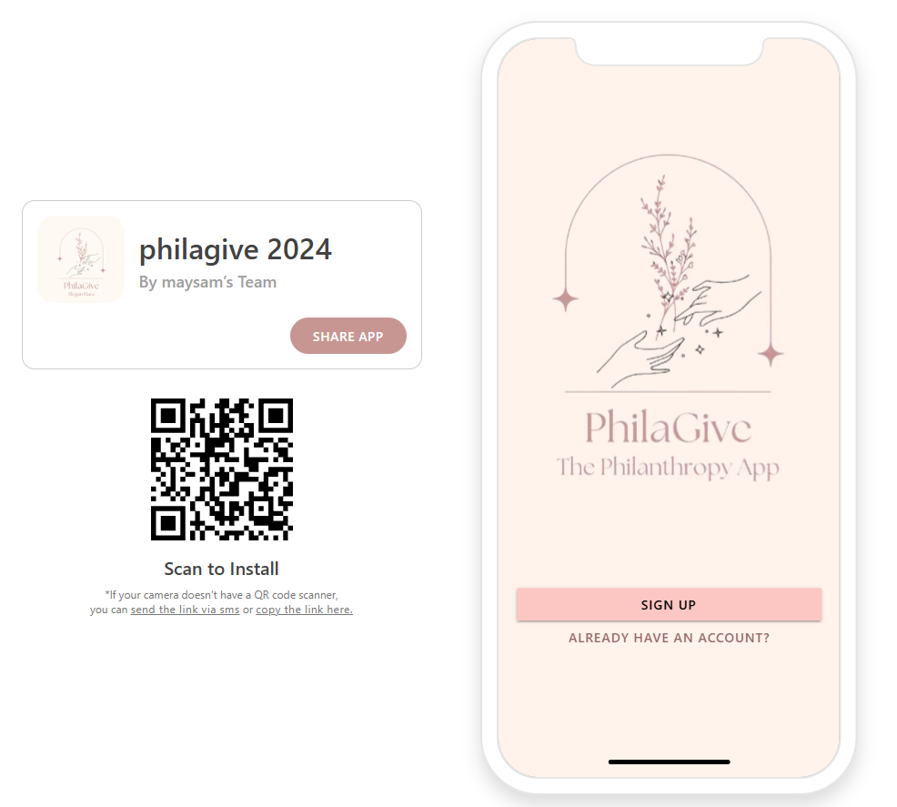
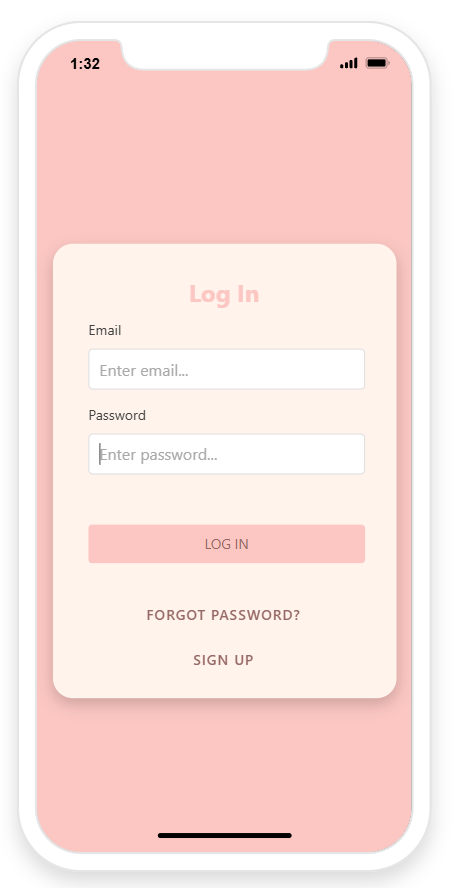
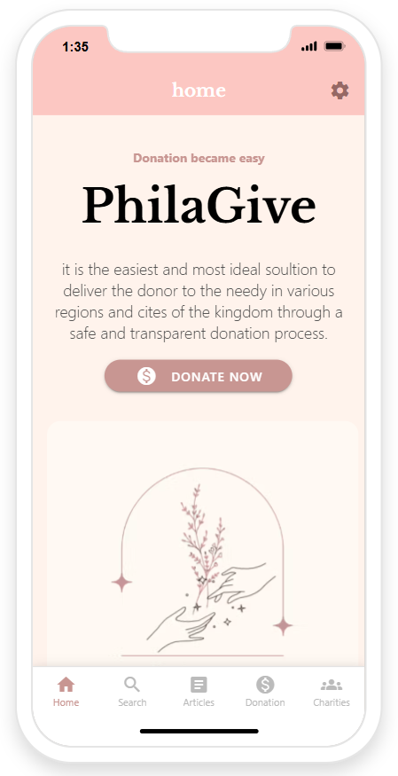
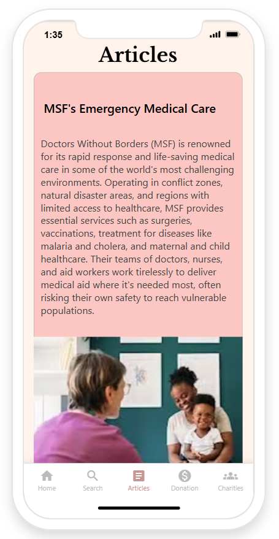
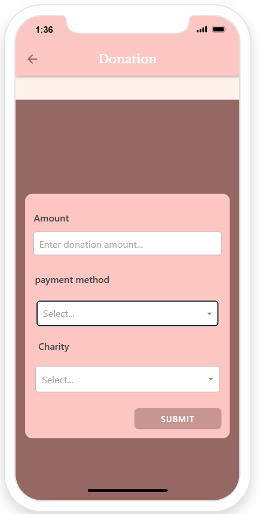
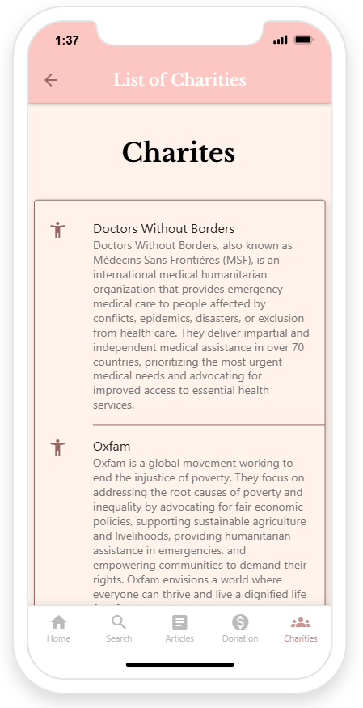

# ❤️ PhilaGive

### An Interactive Charity Donation Platform

A Software Engineering project that connects **donors** and **charitable organizations** through an intuitive donation platform built with **Adalo**, following modern Software Engineering principles.

🚀 **Live Demo**

https://maysams-team.adalo.com/philagive-2024

---

# 📖 Overview

PhilaGive is a mobile donation platform designed to simplify charitable giving while strengthening communication between donors and nonprofit organizations.

The application enables users to discover charitable causes, make secure donations, browse charity updates, and track donation history. Organizations can register, publish articles, receive donations, and manage their public profiles.

The project was developed as part of the **Software Engineering** course using **Adalo** and follows structured software development practices including requirements engineering, UML modeling, database design, system analysis, testing, and UI/UX design.

---

# ✨ Features

## 👤 User Management

- User Registration
- Secure Login
- Profile Management
- Account Settings

---

## ❤️ Donation System

- Donate to charities
- Donation history
- Digital receipts
- Multiple payment methods

---

## 🏢 Charity Management

- Charity Registration
- Charity Profiles
- Project Updates
- Donation Tracking

---

## 📰 Articles

- Publish Articles
- Browse Articles
- Like Articles
- Comment on Articles

---

## 🔍 Search

- Search Charities
- Search Articles
- Filter Results

---

# 🛠 Tech Stack

| Category | Technologies |
|----------|--------------|
| Platform | Adalo |
| Design | UI/UX Design |
| Methodology | Software Engineering |
| Architecture | MVC |
| Modeling | UML |
| Database | Relational Database Design |
| Documentation | Software Requirements Specification |

---

# 🏗 Software Engineering Process

The project was developed following a complete Software Engineering lifecycle.

- Requirements Analysis
- Functional Requirements
- Non-Functional Requirements
- UML Modeling
- Database Design
- User Interface Design
- Testing
- Refactoring
- Evaluation

---

# 📐 System Design

The system follows the **Model-View-Controller (MVC)** architecture to improve:

- Maintainability
- Scalability
- Separation of Concerns
- Code Organization

---

# 📊 UML Diagrams

The project includes:

- Use Case Diagram
- Data Flow Diagram (DFD)
- Class Diagram
- Entity Relationship Diagram (ERD)
- Activity Diagrams
- Sequence Diagrams

---

# 📱 Application Screens

## Welcome

---

## Login

---

## Home

---

## Articles

---

## Donation

---

## Charity List

---

# 📄 Documentation

| Resource | Link |
|----------|------|
| 📘 Project Report | docs/Project_Report.pdf |
| 📌 Project Poster | poster/PhilaGive_Poster.pdf |

---

# 🧪 Testing

The application was tested across its major functionalities, including:

- User Registration
- Login
- Search
- Articles
- Donations
- Navigation
- Profile Management

Testing validated the application's usability and overall functionality while identifying opportunities for future improvements in verification workflows.

---

# 🚀 Future Improvements

- Payment Gateway Integration
- Email Verification
- Push Notifications
- Admin Dashboard
- Analytics Dashboard
- Multi-language Support
- Dark Mode
- Real-time Notifications

---

# 👩‍💻 My Contributions

As a member of the development team, I contributed to:

- Home Page Design
- Settings Page
- Charity List Interface
- UI/UX Design
- System Analysis
- Software Documentation
- Software Testing

---

# 👥 Team

- **Maysam Abduljalil**
- Futun Alharthi
- Sara Alfaifi

---

# 🎓 Academic Information

**Course**

Software Engineering

**Instructor**

Dr. Areej Alfraih

---

# 🌟 Live Prototype

### Try PhilaGive

https://maysams-team.adalo.com/philagive-2024

---

### ⭐ If you found this project interesting, don't forget to give it a Star!

Made with ❤️ by **Maysam Abduljalil**

